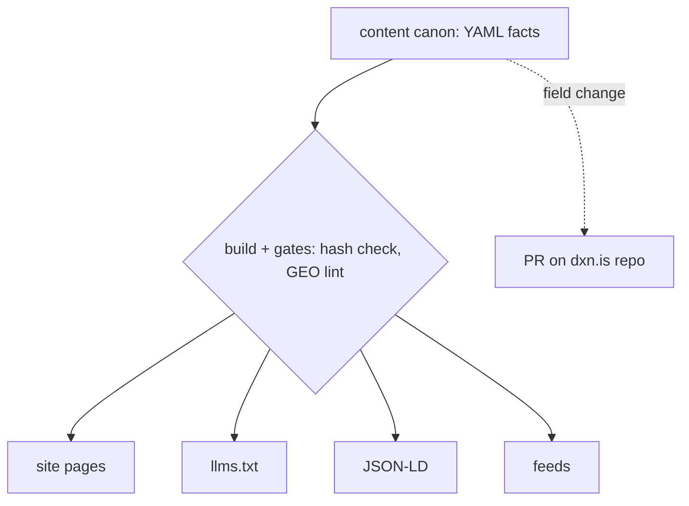
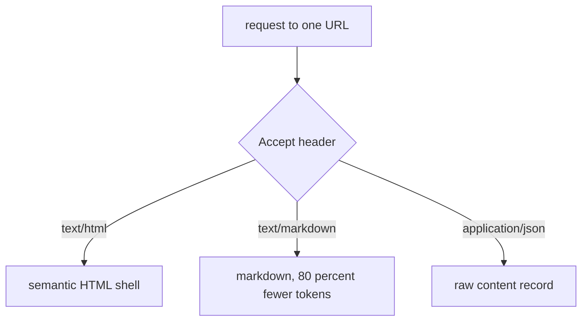
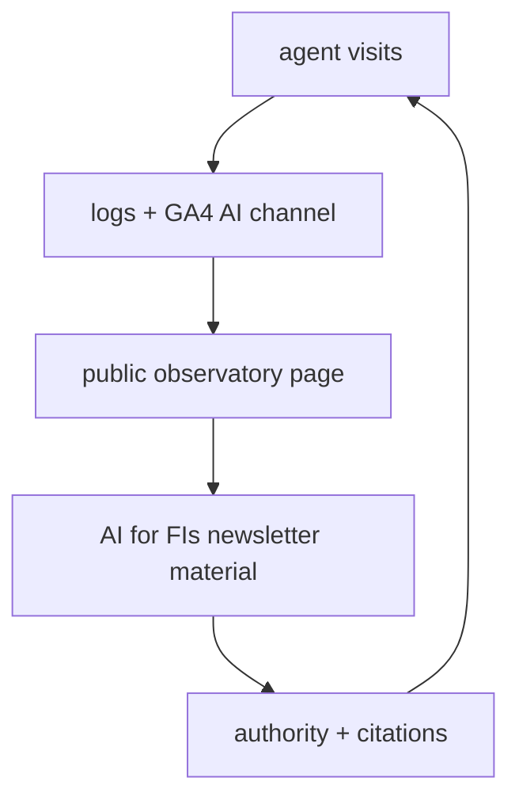

# Ideation: dxn.md, the agent-optimized companion site

## Grounding Context

**Topic Context.** dxn.is is a pure static site: one ~750-line `index.html`, hand-written CSS/JS, no build step, no content layer. Repo `septapod/dxnis`, deployed on Vercel via GitHub push. It already has real agent-readiness assets: an `llms.txt` (~1,800 words, llmstxt.org convention, with an explicit agent instruction set), an `/agents` explainer page, five Schema.org JSON-LD blocks, and the footer line "A site for humans and agents." The pain: all copy is hardcoded in HTML, `llms.txt` is maintained by hand and has already drifted from the site bio (Moeda Seeds and Communitere appear only in `llms.txt`), the 24-client list lives in a JavaScript array no AI crawler can read, and the latest-newsletter card requires a runtime serverless function. The AI for FIs newsletter has a live Beehiiv RSS feed.

**External context (June 2026).** The discipline is called GEO or AEO interchangeably. The strongest content evidence is the Princeton GEO paper (ACM SIGKDD 2024): adding statistics lifts AI-answer visibility +41%, citing external sources +30% (+115% for low-ranked content), quotations +28%; keyword stuffing hurts (-10%). The strongest technical evidence: Anthropic infrastructure actively sends `Accept: text/markdown` requests (44-day study: 500 requests from Claude infrastructure alone), and Cloudflare shipped edge markdown conversion in February 2026 with ~80% token reduction. AI crawlers do not execute JavaScript, all honor robots.txt, and GPTBot revisits roughly every 2.4 days favoring `/blog/`-style dated content. `llms.txt` is fetched routinely by IDE and desktop agents (Cursor, Claude Code, Windsurf) but is not confirmed read by any major search-time crawler. Schema.org JSON-LD evidence is contradictory (Ahrefs measured a -4.6% citation decline after adding it; Google and Microsoft confirm using it). GA4 added a free native "AI Assistant" traffic channel on 2026-05-13. NLWeb (`/ask` + `/mcp` endpoints) is real and deployable with thin adoption outside developer sites. Median time from publication to first AI citation: 6.81 days; uncited at 37+ days signals a structural problem.

**Constraints.** GitHub + Vercel. The dxn.md domain is purchased; DNS connects later. Two-site content sync is required (not byte-identical; different audiences). Agentic-search experimentation is an explicit goal. The build is autonomous and the site must run without sustained manual editorial effort.

## Topic Axes

1. content-source — the canonical machine-readable content model (bio, services, clients, testimonials, newsletter as data)
2. agent-access — the protocols and surfaces agents touch (llms.txt, markdown negotiation, robots.txt, .well-known, NLWeb/MCP, feeds)
3. citation-content — content tactics that win citations (statistics, quotes, FAQ structure, fact density, authority, freshness)
4. sync — dxn.is to dxn.md propagation, source of truth, drift detection
5. measurement — agent traffic analytics, citation tracking, experiment design

---

## Ranked Ideas

Jump list: [1. Canonical facts layer](#1-canonical-facts-layer-everything-else-is-a-build-artifact) · [2. Agent access layer](#2-agent-access-layer-markdown-and-json-on-every-url) · [3. Vendor-diligence dossier](#3-vendor-diligence-dossier-with-an-embedded-quote-bank) · [4. Newsletter wire archive](#4-newsletter-wire-archive) · [5. Identity card and authority record](#5-identity-card-and-name-authority-record) · [6. MCP server and /ask endpoint](#6-mcp-server-and-ask-endpoint) · [7. Lab instrumentation and public observatory](#7-lab-instrumentation-and-public-observatory)

### 1. Canonical facts layer: everything else is a build artifact

**Description:** A structured content canon (`content/*.yaml` or JSON: bio, services, clients, testimonials, framework, contact, agent instructions) lives in the dxn.md repo as the single source of truth for the business's facts. Every surface is generated from it at build time: site pages, `llms.txt`, JSON-LD, feeds. The build enforces quality structurally: a hash of the canon is stamped into derived surfaces and the deploy fails on mismatch; a GEO linter fails any content page missing statistics, an attributed quote, an external citation, or a dated byline; facts carry `last_verified` dates so staleness is visible instead of silent. The sync story with dxn.is becomes simple: dxn.md owns the facts, and a CI job can later open a PR on `septapod/dxnis` when canon fields change.

**Axis:** content-source (and it dissolves the sync axis)
**Basis:** direct: dxn.is "llms.txt maintained MANUALLY; already diverged from HTML bio (Moeda Seeds/Communitere only in llms.txt)"; "All copy hardcoded in one HTML file; no content layer separate from presentation"; "Client list lives in a JS array, not structured data" — and AI crawlers execute no JavaScript, so that client list is currently invisible to every agent.
**Rationale:** The manual-maintenance model has already failed once in one site; two sites double the drift surface. A generated-everything architecture is the only design that satisfies both the sync requirement and the no-human-editorial constraint, because correctness becomes a build property instead of a discipline. Five of five ideation frames independently converged on this idea.
**Downsides:** Up-front modeling work; the dxn.is side of the sync (PR bot) depends on dxn.is gaining a structured data target it does not have today, so full two-way sync lands in a later phase.
**Confidence:** 90%
**Complexity:** Medium

### 2. Agent access layer: markdown and JSON on every URL

**Description:** Vercel middleware inspects the `Accept` header on every route: browsers get minimal semantic HTML, `Accept: text/markdown` gets clean markdown, `application/json` gets the raw content record, with `Vary: Accept` and an `x-markdown-tokens` cost header. Around it, the access plumbing: a robots.txt that explicitly welcomes citation-time bots (PerplexityBot, OAI-SearchBot) and states policy for training-only bots; `.well-known` agent-manifest stubs hedged across the competing specs; accurate `Last-Modified`/`ETag` headers and sitemap `lastmod`; an append-only change feed (Atom + JSON) generated from git history so revisiting crawlers can cheaply answer "what changed since my last visit."

**Axis:** agent-access
**Basis:** direct: 44-day tracking study — 1,421 markdown-negotiated requests, 500 from Claude infrastructure; external: Cloudflare Markdown for Agents (shipped 2026-02-12, ~80% token reduction); direct: 30-day log study — all four major AI bots honor robots.txt 100%; GPTBot revisits every 2.4 days.
**Rationale:** This is the highest-confidence technical investment in the research: agents are already sending these requests today, and answering them costs one middleware file on the chosen stack. The freshness plumbing targets the 6.81-day median to first citation.
**Downsides:** The JSON representation and change feed are ahead of confirmed demand; `.well-known` specs are unstandardized (stub-level hedge only, cheap to keep current).
**Confidence:** 85%
**Complexity:** Medium

### 3. Vendor-diligence dossier with an embedded quote bank

**Description:** A page written for the agent that is shortlisting consultants on a credit union executive's behalf and must defend its recommendation: fit criteria, explicit disqualifiers ("not a software vendor," "credit unions roughly $200M-$3B in assets," "cooperative and mission-driven organizations"), engagement models, and diligence-phrased Q&A ("What size institutions does he serve?"). Every answer is fact-dense and definitive, and the key claims are formatted as quotable units with attribution embedded inside the extractable text ("Brent Dixon, Dixon Strategic Labs, 2026") so a lifted quote carries its citation by construction.

**Axis:** citation-content
**Basis:** direct: the GEO paper's quantified drivers (statistics +41%, external citations +30%, quotations +28%) and the research's ranked action "definitive fact-dense FAQ page (content structure, not schema, drives citation)"; direct: dxn.is llms.txt already seeds the disqualifier content and the prior learning "agents appreciate being told what not to recommend."
**Rationale:** It targets the actual buying loop: an agent doing vendor diligence needs defensible facts, and disqualifiers are what make a recommendation defensible. One-time write, no maintenance, and the embedded attribution attacks the known failure mode where engines use content but drop the name.
**Downsides:** The citation-to-client chain is plausible but unproven; embedded attribution on every claim can read awkwardly to human visitors (acceptable on an agent-first site).
**Confidence:** 85%
**Complexity:** Low

### 4. Newsletter wire archive

**Description:** A build-time pipeline ingests the AI for FIs Beehiiv RSS feed and renders every issue as a static, dated page in wire-service format: slug, dateline, abstract, key-facts box, stable URL, link to the canonical Beehiiv post. A scheduled weekly rebuild keeps it current with zero editorial effort. This converts Brent's only weekly-refreshed content asset into the deep, dated, fact-dense archive that GPTBot crawls hardest, and removes the runtime serverless dependency for newsletter content.

**Axis:** citation-content
**Basis:** direct: the feed exists (`rss.beehiiv.com/feeds/R3iSBAQYmq.xml`) and "GPTBot: 4,200 hits/day, revisits every 2.4 days, breadth-first, favors /blog/ /docs/"; direct: "Median publication-to-first-AI-citation: 6.81 days" rewards a weekly cadence the rest of the site cannot generate.
**Rationale:** Freshness is the one GEO input that normally demands ongoing human work; the newsletter is the single self-updating source available, so this is the only freshness engine that satisfies the autonomous constraint.
**Downsides:** Republishing full issue content raises canonical-URL and Beehiiv-relationship questions; the safe v1 is abstract-plus-fact-box with a canonical link rather than full-text mirroring. RSS feeds often carry truncated content, which constrains the fact-box extraction.
**Confidence:** 80%
**Complexity:** Medium

### 5. Identity card and name authority record

**Description:** Two faces of one canonical identity surface. `/card`: a sub-4KB markdown/JSON resource answering 90% of agent queries in one fetch (who, what, for whom, proof, disqualifiers, CTAs), which every other surface points at as the atom of record. Behind it, a library-science-style authority record: every affiliation with dates (Dixon Strategic Labs 2022, Filene, UN Innovation Network, Singularity University, Moeda Seeds, Communitere), each with `sameAs` links wired into the Person JSON-LD. This page also repatriates the bio facts that currently exist only in the drifted llms.txt.

**Axis:** content-source
**Basis:** direct: the drift bug ("richer bio than HTML — includes Moeda Seeds co-founder, Communitere International Board Chair") plus the research's authority-signals action; reasoned: agentic retrieval is entity resolution — a model deciding whether to cite Brent must first resolve which Brent and why he is credible, and a dated, cross-referenced record is the structure retrieval systems prefer.
**Rationale:** When an agent spends exactly one fetch on Brent, the card is what gets quoted; forcing the business into 4KB is also the fact-ranking exercise that sharpens every other page.
**Downsides:** Requires discipline that all surfaces actually reference the card; the 4KB cap is a design constraint, not an evidenced threshold.
**Confidence:** 85%
**Complexity:** Low

### 6. MCP server and /ask endpoint

**Description:** dxn.md exposes NLWeb-style endpoints: `/ask` (REST, natural-language question in, structured answer out) and `/mcp` (Model Context Protocol server) backed by the content canon — no runtime LLM required for factual lookups. Agents stop being readers and become clients: "Does Brent work with a $400M credit union?" returns a structured yes with a booking link. Every query is logged verbatim, and the query corpus becomes the demand-driven content backlog: what agents actually ask is what gets built next.

**Axis:** agent-access
**Basis:** external: NLWeb (Microsoft, open-sourced Build 2025; Cloudflare AutoRAG managed path early 2026) — real, deployable, adoption thin outside developer sites; direct: ClaudeBot crawls depth-first favoring `/docs/` and `/api/` paths.
**Rationale:** For a consultant whose brand is agentic AI strategy, a live MCP endpoint is itself a credential, and thin adoption means genuine early-mover differentiation. The query log inverts measurement: citation tracking tells the score, the query log tells what to build.
**Downsides:** Lowest-confidence demand of the survivor set — few agents query consultant sites via MCP today; the payoff is partly positioning and lab data rather than near-term traffic.
**Confidence:** 65%
**Complexity:** Medium

### 7. Lab instrumentation and public observatory

**Description:** Measurement ships on day one: GA4 with the native AI Assistant channel (free, auto-tags AI-referred sessions), Vercel log drain grepped weekly for GPTBot/ClaudeBot/ChatGPT-User/PerplexityBot, and a 37-day post-launch citation audit. Then the flip that makes it compound: an auto-generated public `/observatory` page renders the instrument readings (bot visits by crawler, markdown-negotiation rates, `/ask` query volume, time-to-first-citation), and matched page pairs differing in exactly one GEO variable turn the site into a controlled experiment. The observatory's output is original, stat-dense data about agentic crawling — exactly the content the GEO evidence says wins citations, and weekly material for AI for FIs.

**Axis:** measurement
**Basis:** direct: GA4 AI Assistant channel launched 2026-05-13, free; "Server log grep for GPTBot/ClaudeBot/ChatGPT-User/Perplexity-User: zero-cost baseline"; "Uncited at 37+ days = technical/authority problem"; direct: experimentation is an explicit goal — "this site is partly a lab."
**Rationale:** Without instruments the lab is a guess, and the +41% statistics finding means the lab's own readings are citation bait: measurement overhead converts into the site's freshest original content and feeds the newsletter without anyone writing.
**Downsides:** Log-based attribution is indirect (crawl traffic is not confirmed citation); paired-variant experiments need enough traffic to read, which a new domain will not have for months.
**Confidence:** 75%
**Complexity:** Medium

---

## Rejection Summary

| # | Idea | Reason Rejected |
|---|------|-----------------|
| 1 | Markdown-default site (HTML as the negotiation) | Duplicates the access layer with higher risk; no evidence default-markdown beats content negotiation |
| 2 | Credit-union-AI glossary honeypot | Sound, but the highest refresh burden in the set under the no-editor constraint; citation-content already served by the dossier and archive; strong phase-2 candidate |
| 3 | Claims registry (stable URL per atomic fact) | No external evidence agents navigate atomic-fact URLs; more editorial overhead than it appears |
| 4 | Token budgets as build constraint | No evidence agents read or respect declared budgets; the identity card achieves the economy directly |
| 5 | DNS TXT identity experiment | No evidence any agent reads DNS TXT records; cheap but noise-generating |
| 6 | x402-gated worksheet | Adds friction for the human buyers who are the actual revenue source; research calls it unnecessary for a consultant site |
| 7 | Standalone sync pipeline (drift-lint PRs, hash-gated semver canon) | Not cut, absorbed: merged into idea 1, because every standalone sync mechanism turned out to depend on the canon existing first |
| 8 | Launch-and-never-touch with expiring facts | Hidden human decision when a fact expires; the `last_verified` dating survives inside idea 1 without the overstated framing |
| 9 | Structured clients/testimonials files, GEO linter, quote bank, /ask query log | Absorbed into ideas 1, 1, 3, and 6 respectively rather than standing alone |

No axis ended with zero survivors; the sync axis intentionally has no standalone survivor because its strongest mechanism lives inside idea 1.
