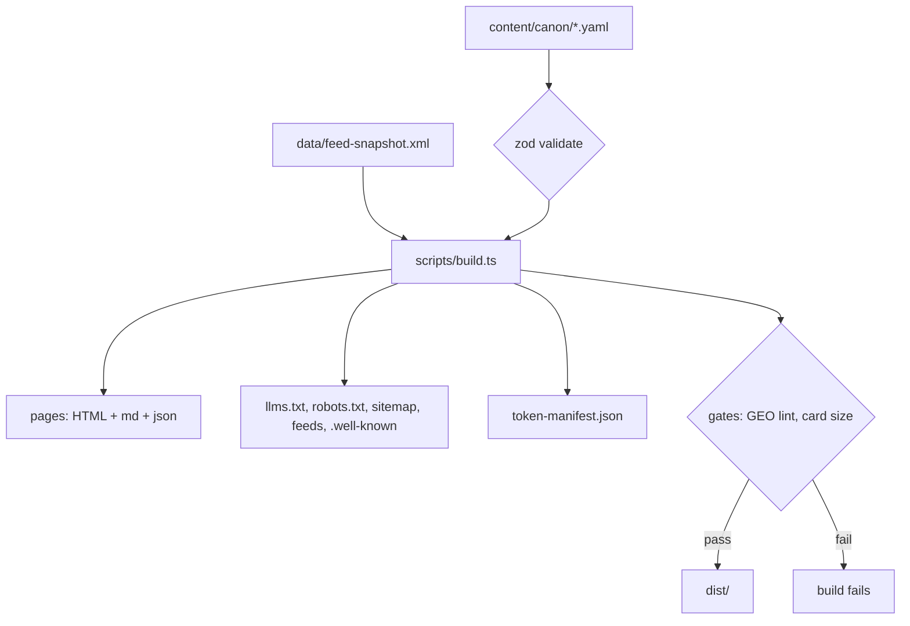
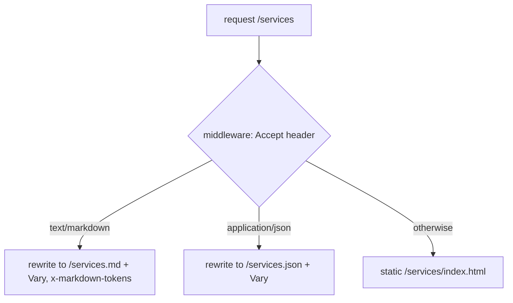

# feat: Build dxn.md, the agent-native consulting site

## Summary

Build dxn.md as a custom TypeScript static-site generator: a YAML content canon compiles to three variants of every page (HTML, markdown, JSON) in `dist/`, Vercel Routing Middleware negotiates the variant by `Accept` header, and build gates (GEO lint, card size, determinism) fail the deploy on violations. Serverless functions add `/ask` and `/mcp` as stretch. Ships to GitHub + Vercel with a weekly self-refresh workflow.

## Problem Frame

See origin doc. Short form: Brent's facts are locked in hand-maintained HTML and a drifted llms.txt, invisible to AI crawlers that execute no JavaScript; dxn.md fixes this with a generated-everything architecture that runs without an editor.

---

## Requirements

Carried from origin (`docs/brainstorms/2026-06-12-dxn-md-agent-site-requirements.md`, R1-R25). Grouped: canon and generation (R1-R4), generated surfaces (R5-R10), agent access (R11-R14), citation content (R15-R17), build gates (R18-R20), measurement (R21-R23), stretch (R24-R25). The plan addresses all 25; units cite origin R-IDs directly.

---

## Key Technical Decisions

- **Custom TypeScript static generator, no framework.** The markdown variant is the primary artifact; frameworks generate HTML and would add weight (hydration JS, version churn) without covering the core need. A bespoke generator keeps every emitted byte intentional, which is the site's whole identity. Pages are data, not templates: each page module returns structured content that the HTML, markdown, and JSON emitters all consume, so variants cannot drift from each other.
- **Variant negotiation via root `middleware.ts` + static files.** Middleware reads `Accept`, rewrites `/services` → `/services.md` or `/services.json`, and sets `Vary: Accept` + `x-markdown-tokens` response headers via `rewrite(url, { headers })` from `@vercel/functions`. Verified: middleware runs before static serving, and Vercel's CDN already keys its cache on `Accept`, so negotiation cannot poison the cache.
- **Token counts from a build manifest, not vercel.json header entries.** Per-file `headers` entries would consume the 2,048-routes-per-deployment cap. The build emits `token-manifest.json`; middleware imports it at build time.
- **Canon as YAML files validated by zod.** Human-editable (Brent's editorial surface), typed at build. One file per domain: bio, services, clients, testimonials, framework, newsletter, contact, agents (instruction set).
- **Canon facts extracted verbatim from the dxnis repo at implementation time.** Bio text, service copy, testimonial quotes, and the client list are copied from `~/dev/dxnis/index.html` and `llms.txt` during U2 — never paraphrased from memory. Fabricated facts on a facts-layer site is the one unrecoverable failure.
- **R18 (no-drift gate) implemented as determinism + no-tracked-generated-files.** Since every surface regenerates on every build, drift between canon and surfaces is structurally impossible; the gate instead enforces the conditions that keep it impossible: CI builds twice and diffs (`--frozen` mode with pinned timestamps), and fails if any `dist/` artifact is tracked in git. Canon hash is stamped into surface metadata for provenance.
- **Change history from a committed data file, not build-time `git log`.** Vercel builds use shallow clones, so git history is unavailable at build time. A CI workflow (full `fetch-depth: 0`) regenerates `data/changes.json` from git history on push and commits it when changed; the Vercel build reads only the committed file. Sitemap `lastmod` derives from `data/changes.json` entries and canon `last_verified` fields, never from build-time git.
- **Header ownership is split with one source of truth per header.** `vercel.json` owns `Content-Type: text/markdown; charset=utf-8` for `.md` paths (one pattern entry, fires on the rewritten path). Middleware owns `Vary: Accept` and `x-markdown-tokens` via `rewrite(url, { headers })` — verified from `@vercel/functions` source: `init.headers` are sent on the user response, distinct from `init.request.headers`. Middleware never sets Content-Type.
- **Newsletter archive from RSS `description` + metadata only.** Feed verified live 2026-06-12: items carry title, description (abstract), canonical link, pubDate, creator, categories. Full `content:encoded` is NOT republished (canonical-URL hazard, per origin). Committed snapshot (`data/feed-snapshot.xml`) is the build input; the weekly workflow refreshes it.
- **`.well-known` stubs: `ai-agent.json` (Aiia) and `agent-card.json` (A2A).** Wildcard's `agents.json` is dormant (no activity since 2025-08) and requires an OpenAPI source to be non-trivial — skipped, recorded here.
- **MCP via `mcp-handler@1.1.0` + `@modelcontextprotocol/sdk@1.26.0` (pinned; earlier SDKs have a security vulnerability), streamable HTTP, rewrite scoped to `/mcp` only** — the template's catch-all rewrite would swallow the static site.
- **`/ask` logs queries via function logs (`console.log`), no datastore.** Zero provisioning; queries retrievable from Vercel logs. A persistent query store is deferred until demand is proven.
- **GA4 by build-time env var** (`GA4_MEASUREMENT_ID`): when unset, no script tag is emitted; agents never receive analytics JS in markdown/JSON variants either way.

---

## High-Level Technical Design





## Output Structure

```
dxn-md/
├── package.json / tsconfig.json / vitest.config.ts / vercel.json
├── middleware.ts
├── content/canon/{bio,services,clients,testimonials,framework,newsletter,contact,agents}.yaml
├── data/{feed-snapshot.xml, observatory/*.json}
├── src/
│   ├── canon/{schema.ts, load.ts}
│   ├── build/{html.ts, markdown.ts, jsonld.ts, emit.ts, feed.ts, tokens.ts, changes.ts, lint-geo.ts, gates.ts}
│   └── pages/{home,services,about,clients,dossier,card,agents-page,newsletter,observatory}.ts
├── scripts/{build.ts, refresh-rss.mjs}
├── api/{ask.ts, mcp.ts}            # stretch
├── .github/workflows/{ci.yml, refresh.yml}
├── docs/{plans/, brainstorms/, ideation/, audit-37-day.md, setup-brent.md}
└── tests/*.test.ts
```

---

## Implementation Units

### Phase A — Foundation

### U1. Scaffold and toolchain

**Goal:** Compilable, testable, deployable empty project.
**Requirements:** R14 (config-derived URLs).
**Dependencies:** none.
**Files:** `package.json`, `tsconfig.json`, `vitest.config.ts`, `vercel.json`, `.gitignore`, `README.md`, `src/config.ts`.
**Approach:** `"type": "module"`, Node 24 (`engines`), deps: `zod`, `yaml`, `fast-xml-parser`, `gpt-tokenizer`; dev: `typescript`, `vitest`, `@vercel/functions`. `vercel.json`: `buildCommand: npm run build`, `outputDirectory: dist`, plus one pattern header forcing `Content-Type: text/markdown; charset=utf-8` on `/(.*).md`. `src/config.ts` reads `SITE_URL` env with vercel.app fallback.
**Test scenarios:** Test expectation: none — scaffolding; CI proves typecheck+test+build run.
**Verification:** `npm run build` produces empty `dist/` without error; `npx tsc --noEmit` clean.

### U2. Content canon with verbatim fact extraction

**Goal:** The complete, validated facts layer.
**Requirements:** R1, R3, R4.
**Dependencies:** U1.
**Files:** `content/canon/*.yaml` (8 files), `src/canon/schema.ts`, `src/canon/load.ts`, `tests/canon.test.ts`.
**Approach:** zod schemas typed per domain; every fact-bearing entry carries `last_verified: 2026-06-12`. Extract copy verbatim from the dxnis repo (`index.html`, `llms.txt`, `js/main.js` client array): bio including Moeda Seeds and Communitere repatriation, 3 services, full client list, 4 testimonials with exact quote text and attribution, three-conditions framework, newsletter metadata, contact/CTAs, agent instruction set (fit band, disqualifiers, canonical CTAs).
**Execution note:** Read the dxnis source files directly; copy, never paraphrase. Any fact not found verbatim in a source is omitted, not reconstructed.
**Test scenarios:** canon loads and validates (happy path); a canon file with a missing required field fails validation with the field named (error path); bio contains "Moeda Seeds" and "Communitere" (Covers AE2 precondition); client list length matches the dxnis source array.
**Verification:** `tests/canon.test.ts` green; spot-check YAML against dxnis sources.

### U3. Generator core: tri-variant emitters

**Goal:** One page definition → `route/index.html`, `route.md`, `route.json` with shared content.
**Requirements:** R2, R7, R11 (artifact side), R12.
**Dependencies:** U2.
**Files:** `src/build/{html.ts, markdown.ts, jsonld.ts, emit.ts, tokens.ts}`, `scripts/build.ts`, `tests/emit.test.ts`.
**Approach:** A `Page` is structured data (title, byline date, sections of typed blocks: prose, facts, quotes, stats, links). Emitters render blocks per format; HTML is semantic, zero JS (GA4 snippet slot excepted), inline JSON-LD from canon; markdown is the canonical "clean" rendering; JSON is the raw page record plus canon hash + last_verified. `tokens.ts` counts each `.md` with `gpt-tokenizer` (o200k_base) into `dist/token-manifest.json` and a build-src copy for middleware import.
**Test scenarios:** all three variants contain the same facts for a fixture page (happy path); HTML contains no `<script>` when GA4 unset (Covers AE6); JSON-LD parses and includes Person block; token manifest has an entry per emitted `.md`.
**Verification:** fixture build emits 3 files per page; tests green.

### Phase B — Surfaces

### U4. Core pages

**Goal:** The seven canon-driven pages (observatory, the eighth page required by R5, is built in U9 with its data files — cross-reference, not a gap).
**Requirements:** R5, R10, R15, R16 content side; origin F2.
**Dependencies:** U3.
**Files:** `src/pages/{home,services,about,clients,dossier,card,agents-page}.ts`, `tests/pages.test.ts`.
**Approach:** home (orientation + pointers to card/dossier); services; about as the authority record (dated affiliations, sameAs links); clients (structured list with engagement types); dossier (fit criteria, explicit disqualifiers, diligence Q&A, quotable units with embedded attribution "— Brent Dixon, Dixon Strategic Labs, 2026"); card (sub-4KB single-fetch answer, all surfaces link it); agents-page (how the site works for agents: negotiation, llms.txt, feeds, /mcp). Every substantive page satisfies the GEO rule by construction (stats from canon/GEO-relevant numbers, attributed quote, external citation, dated byline).
**Test scenarios:** card.md < 4096 bytes (Covers AE4); dossier contains at least one disqualifier and one embedded-attribution quote; about contains Moeda Seeds + Communitere (Covers AE2 surface side); every page's markdown starts with title + dated byline.
**Verification:** build emits all pages; tests green.

### U5. Newsletter wire archive

**Goal:** Self-refreshing issue archive from the Beehiiv feed.
**Requirements:** R17; origin F4 (build side), AE5.
**Dependencies:** U3.
**Files:** `src/build/feed.ts`, `src/pages/newsletter.ts`, `data/feed-snapshot.xml`, `tests/feed.test.ts`.
**Approach:** Parse snapshot with `fast-xml-parser`; emit `/newsletter` index + `/newsletter/<slug>` per item (slug from canonical link path). Page: title, dateline, abstract (feed `description`), categories as topics, prominent canonical link. No `content:encoded` republication. The build reads only the committed snapshot; live fetch happens exclusively in `scripts/refresh-rss.mjs`.
**Test scenarios:** snapshot parses to ≥1 issue page with abstract + canonical link (Covers AE5); malformed item is skipped with a warning, not a crash (error path); slug collision dedupes deterministically (edge).
**Verification:** build emits archive from committed snapshot; tests green.

### U6. Protocol surfaces

**Goal:** Discovery and freshness plumbing.
**Requirements:** R6, R8, R9; origin F2.
**Dependencies:** U4, U5 (needs final route list).
**Files:** `src/build/changes.ts`, generators in `scripts/build.ts` for `llms.txt`, `robots.txt`, `sitemap.xml`, `.well-known/ai-agent.json`, `.well-known/agent-card.json`, `changes.xml` + `changes.json`, `tests/protocol.test.ts`.
**Approach:** llms.txt generated from canon (llmstxt.org shape, links to `.md` variants, token costs from manifest); robots.txt welcomes PerplexityBot/OAI-SearchBot/GPTBot/ClaudeBot with policy comments, blocks nothing by default (CCBot decision documented for Brent); sitemap lastmod and the change feed (Atom + JSON) both render from the committed `data/changes.json` plus canon `last_verified` fields, per the change-history KTD — the CI workflow owns regenerating that file from full-depth git history.
**Test scenarios:** llms.txt contains Moeda Seeds (Covers AE2); sitemap covers every HTML route exactly once; change feed entries are date-descending; .well-known stubs parse as JSON with required fields (`name`/`description`; `agent-card` minimal shape).
**Verification:** files present in `dist/`; tests green.

### Phase C — Access and gates

### U7. Content negotiation middleware

**Goal:** One URL, three representations, correct headers.
**Requirements:** R11, R13; origin F1, AE1.
**Dependencies:** U3 (token manifest).
**Files:** `middleware.ts`, `tests/middleware.test.ts`.
**Approach:** Matcher excludes `/api/*`, `.well-known`, files with extensions, and feeds. Parse `Accept`: prefer `text/markdown` → rewrite to `<path>.md` with `{ headers: { Vary: 'Accept', 'x-markdown-tokens': <manifest> } }`; `application/json` (when preferred over html) → `<path>.json`; else pass through with `Vary: Accept` via `next({ headers })`. Content-Type is owned by `vercel.json` per the header-ownership KTD. ETag/Last-Modified come from Vercel static serving on direct requests (verified automatic); their presence on middleware-rewritten responses is unverified — U11's smoke test checks it, and if absent the middleware adds a content-hash ETag from the token manifest's sibling hash field.
**Test scenarios:** Covers AE1: markdown Accept yields `.md` rewrite with both headers; browser-style Accept passes through; `Accept: application/json` yields `.json`; q-values respected when html outranks markdown (edge); unknown path falls through untouched; `/api/ask` never intercepted (integration with matcher).
**Verification:** unit tests against exported decision function; live curl check in U11.

### U8. Build gates and CI

**Goal:** Citability and drift-impossibility as build failures.
**Requirements:** R16, R18, R19, R20; origin AE3, AE4.
**Dependencies:** U4 (pages to lint).
**Files:** `src/build/{lint-geo.ts, gates.ts}`, `.github/workflows/ci.yml`, `tests/gates.test.ts`.
**Approach:** GEO lint runs on substantive pages (explicit include list: home, services, about, clients, dossier; card/feeds/observatory exempt; newsletter issues exempt-but-warned — a deliberate deviation from origin R19's letter, recorded here: wire pages summarize canonical Beehiiv content, and forcing the stat/quote rule on them would push toward fabricated facts): requires ≥2 statistics, ≥1 attributed quote, ≥1 external citation, dated byline; failure names page and rule. Card gate: `card.md` ≤ 4096 bytes. CI: typecheck → tests → build → build again and diff (`--frozen` stamps SOURCE_DATE_EPOCH) → fail if `git ls-files dist` non-empty.
**Test scenarios:** Covers AE3: removing a statistic from a fixture page fails lint naming page+rule; oversize card fails (Covers AE4); exempt page with no quote passes; determinism check passes on identical double-build.
**Verification:** CI green on the repo; deliberate violation fails locally.

### Phase D — Measurement and operations

### U9. Instrumentation, observatory, weekly refresh

**Goal:** Day-one measurement and zero-touch freshness.
**Requirements:** R21, R22, R23; origin F4.
**Dependencies:** U3, U4, U5, U6.
**Files:** `src/pages/observatory.ts`, `data/observatory/{bots.json, negotiation.json, queries.json}`, `scripts/refresh-rss.mjs`, `.github/workflows/refresh.yml`, `docs/audit-37-day.md`, `docs/setup-brent.md`, `tests/observatory.test.ts`.
**Approach:** GA4 snippet emitted only when `GA4_MEASUREMENT_ID` set at build (HTML variant only). Observatory renders committed data files with honest empty states ("not yet wired — see setup"). Weekly workflow (cron Mon 06:00 UTC, `contents: write`, `actions/checkout` at the latest major — researcher and reviewer disagreed on the current version, so verify via `gh api repos/actions/checkout/releases/latest` at implementation): refresh snapshot, commit if changed (bot push auto-triggers Vercel deploy — verified). A second push-triggered CI step with `fetch-depth: 0` regenerates `data/changes.json` per the change-history KTD. `docs/setup-brent.md` documents Brent's dashboard tasks: DNS, GA4 property + env var, optional log drain, MCP announcement. 37-day audit checklist per origin R23.
**Test scenarios:** observatory renders empty-state copy when data files are empty (happy/edge); GA4 absent from HTML when env unset (Covers AE6 adjunct); refresh script writes a well-formed snapshot from a fixture feed and is a no-op on identical content.
**Verification:** workflow YAML validates (`actionlint` if available, else careful review); local run of refresh script against live feed.

### Phase E — Stretch and deploy

### U10. /ask and /mcp endpoints (stretch)

**Goal:** The site answers questions, not just serves files.
**Requirements:** R24, R25.
**Dependencies:** U2; U6 (agents-page links).
**Files:** `api/ask.ts`, `api/mcp.ts`, `tests/ask.test.ts`, `vercel.json` (add `/mcp` rewrite + function config).
**Approach:** `/ask`: POST {question} → keyword/intent retrieval over canon JSON (services, fit, contact, newsletter latest) → structured answer {answer, facts[], links[], confidence}; logs `{ts, question}` via `console.log`. `/mcp`: `createMcpHandler` with tools `get_card`, `get_services`, `check_fit(asset_size, org_type)`, `get_latest_newsletter`, `get_contact`; pinned deps per KTD; rewrite scoped to `/mcp` only.
**Execution note:** Build only after U1-U9 are green; skip without guilt if anything upstream needed rework — the canon makes this cheap to add later.
**Test scenarios:** fit question inside the band answers eligible with the band cited (happy); out-of-band asset size answers not-a-fit with disqualifier (Covers origin disqualifier intent); unanswerable question returns low-confidence + card link, never fabricates (error path); ask handler rejects non-POST (edge).
**Verification:** unit tests green; live POST in U11.

### U11. Repo, deploy, live smoke test

**Goal:** Public GitHub repo, production Vercel deployment, acceptance examples verified live.
**Requirements:** R14; origin AE1-AE6 live verification.
**Dependencies:** all prior.
**Files:** none new (operations); README finalized.
**Approach:** `git init` + conventional commits per phase; `gh repo create` (private default — Brent flips public when ready; record choice); `vercel` CLI link + deploy if authenticated, else document exact dashboard steps in `docs/setup-brent.md` and stop gracefully. Smoke: curl AE1 (negotiation + Vary + x-markdown-tokens), ETag/Last-Modified presence on the rewritten `.md` response (per U7's open question), AE2 (llms.txt facts), AE3 end-to-end against the real dossier page (deliberate stat removal locally, restore), AE6 (no-JS content), `.md` Content-Type, /ask + /mcp if shipped.
**Test scenarios:** Test expectation: none — operational unit; the smoke checklist is the verification.
**Verification:** deployment URL responds; smoke checklist recorded in PROJECT_STATUS.md.

---

## Scope Boundaries

Carried from origin. **Deferred for later:** dxn.is-side sync PR bot; paired-variant GEO experiments; CU-AI glossary; citation-tracking SaaS decision. **Outside this product's identity:** x402 payments; DNS TXT identity records; full-text newsletter mirroring; persuasion copy. **Deferred to follow-up work (plan-local):** persistent /ask query store; observatory log-drain ingestion automation; Wildcard agents.json (dormant spec); OpenAPI spec for the JSON surfaces.

## Assumptions

- Headless-run bets a reviewer should know: the no-framework KTD trades framework conveniences for transparency on a site whose audience reads source; YAML canon (not JSON) optimizes for Brent's hand-edits; GEO-lint thresholds (2 stats / 1 quote / 1 citation) operationalize origin R16 from the GEO paper's three measured drivers; `gh`/`vercel` CLI auth is assumed present, with documented graceful stop if not.
- Vercel serves `.md` static files with an unknown default Content-Type — mitigated by the forced header in U1, verified live in U11.
- The dxnis repo at `~/dev/dxnis` remains the accurate copy source at U2 time (its live site matched the repo on 2026-06-12).

## Risks & Dependencies

- **Beehiiv feed shape changes** → builds keep working from the committed snapshot; refresh script validates before committing. Low blast radius.
- **`mcp-handler`/SDK churn** → versions pinned; stretch-scoped so core site never depends on it.
- **Middleware matcher mistakes could intercept assets or api routes** → explicit matcher tests in U7.
- **GEO lint too strict for future pages** → rule list and exemptions live in one file; failure messages name the rule.

## Sources / Research

- Origin: `docs/brainstorms/2026-06-12-dxn-md-agent-site-requirements.md`; ideation: `docs/ideation/2026-06-12-dxn-md-agent-site-ideation.md`.
- Stack fact sheet (June 2026, verified citations): Vercel Routing Middleware runs pre-static and supports `rewrite(url, {headers})` (`vercel.com/docs/routing-middleware`); CDN keys cache on `Accept` already; 2,048 routes/deployment cap; ETag/Last-Modified automatic for static; `mcp-handler@1.1.0` + SDK 1.26.0 pinned (`github.com/vercel/mcp-handler`); Cloudflare `x-markdown-tokens` is an unspecified estimate — `gpt-tokenizer` o200k_base chosen and the encoding recorded in page JSON; weekly Action bot pushes auto-trigger Vercel deploys (`vercel.com/docs/git/vercel-for-github`).
- Beehiiv feed verified live 2026-06-12: items carry title/description/link/pubDate/creator/categories + full content.
- Grounding dossiers: `/tmp/compound-engineering/ce-ideate/ca05bcc5/{grounding-context,web-research-result}.md`.
